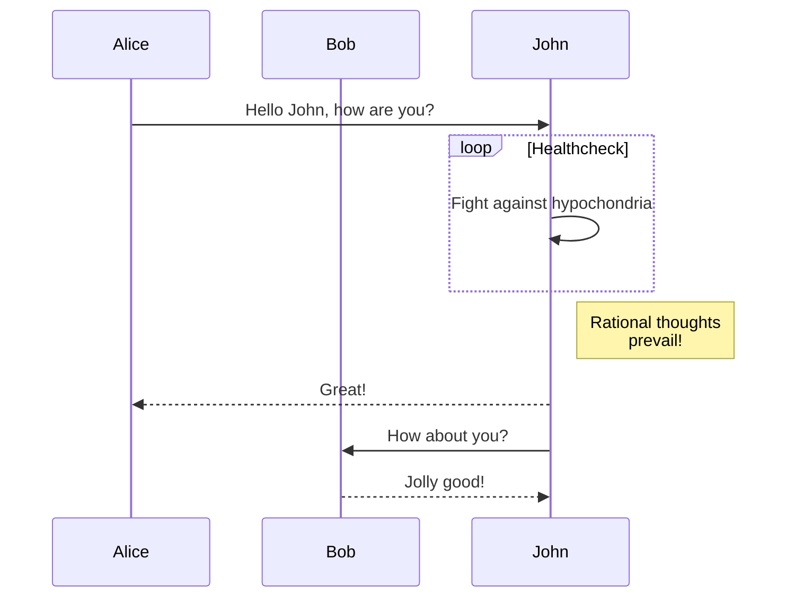

# Markdown - Hits and Tips

## Table of Contents - TOC

Hunter Tran has created a create extention called [Auto Markdown TOC](https://marketplace.visualstudio.com/items?itemName=huntertran.auto-markdown-toc) which automatically creates a TOC for you in a Markdown file.

<!-- TOC depthfrom:2 -->

- [Table of Contents - TOC](#table-of-contents---toc)
- [Colapsable Code Snippet](#colapsable-code-snippet)
- [Diagrams](#diagrams)

<!-- /TOC -->

## Colapsable Code Snippet

Creating a collapsable section in Markdown is as simple as adding from HTTP.

<details>
<summary><b>Expand for JSON code.</b></summary>
<p>

```json
    "markdownlint.config": {
        "MD013": false,
        "MD022": false,
        "MD033": false,
        "MD036": false,
        "MD041": false
    }
```

</p>
</details>

## Diagrams

To create and preview sequence in Markdown, you will need to install [Markdown Preview Mermaid Support](https://marketplace.visualstudio.com/items?itemName=bierner.markdown-mermaid) for Visual Studio Code.

Below is an example of the syntax you would use.

> This is compatiable to GitHub and GitLab.

